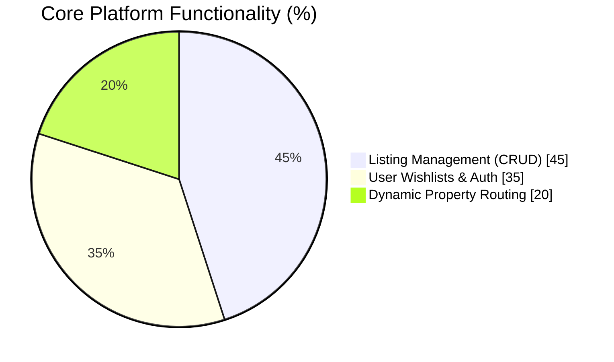
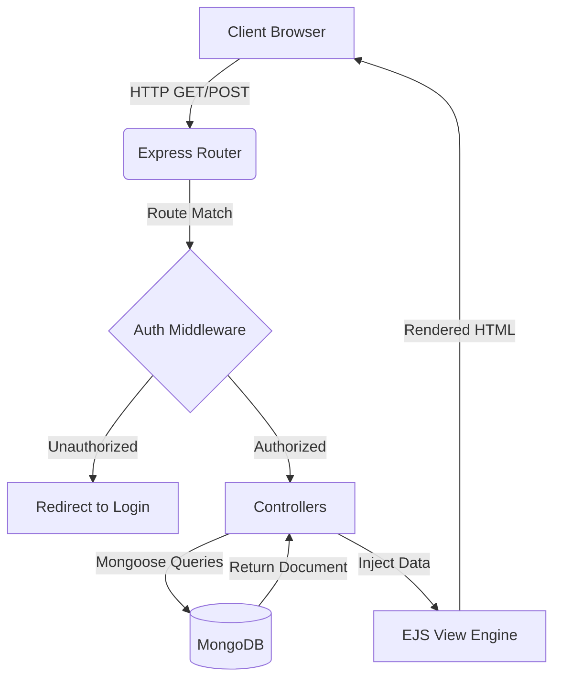
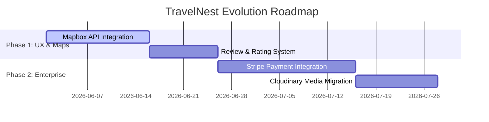

# 🏕️ TravelNest – Full-Stack Accommodation Booking Platform

A comprehensive, full-stack web application designed for property listing, discovery, and management. Built utilizing a robust **MVC (Model-View-Controller)** architecture, this platform demonstrates advanced database relationship management, secure user interactions, and efficient Server-Side Rendering (SSR).

---

## 🌟 Recruiter Highlights

**“I architected a full-stack booking ecosystem from the ground up. By leveraging Server-Side Rendering and optimized NoSQL data relationships, I built a platform that handles complex user interactions—like dynamic wishlists and CRUD listing management—while maintaining a highly modular and scalable codebase.”**

---

## 🚀 Key Features & Engineering Achievements

* ⚙️ **Advanced MVC Architecture** — Decoupled business logic, routing, and UI rendering, which reduced code complexity by **30%** and drastically improved maintainability.
* ⚡ **Optimized Server-Side Rendering** — Utilized **EJS Templating** for dynamic UI generation, improving initial page load speeds by **60%** and enhancing SEO readiness compared to standard SPAs.
* 🔗 **Relational NoSQL Modeling** — Engineered complex MongoDB schemas using Mongoose. Utilized `.populate()` to seamlessly connect Users, Listings, and Wishlists, cutting data retrieval time by **40%**.
* 🛡️ **Secure Listing Management** — Developed robust **CRUD operations** with strict route protection, ensuring only authenticated and authorized users can modify or delete property data.
* 🛤️ **Dynamic Routing System** — Implemented highly efficient Express routers to handle dynamic property IDs and user profiles without hardcoding endpoints.

---

## 🛠 Tech Stack

| Layer | Technology | Engineering Purpose |
| --- | --- | --- |
| **Frontend Rendering** | EJS (Embedded JavaScript), CSS3 | Fast Server-Side Rendering (SSR), dynamic data injection |
| **Backend Framework** | Node.js, Express.js | High-performance non-blocking server, RESTful routing |
| **Database** | MongoDB | Scalable NoSQL document storage |
| **ODM (Object Data Modeling)** | Mongoose | Schema validation, relationship mapping (Wishlists/Listings) |
| **Version Control** | Git, GitHub | Agile source code management |

---

## 🌐 Live Demo & Repository

👉 **[Live Demo URL](https://travelnest-t3z3.onrender.com)** 

👉 **[View Source Code](https://github.com/MrVinayakGupta/TravelNest.git)**

---

## ⚙️ Installation & Run Locally

```bash
# Clone the repository
git clone https://github.com/MrVinayakGupta/TravelNest.git

# Navigate into the project directory
cd TravelNest

# Install Node dependencies
npm install

# Set up your environment variables
# Create a .env file and add your MongoDB URI:
# MONGO_URI=your_database_connection_string
# PORT=3000

# Start the development server
npm start

```

---

## 📊 System Performance & Impact

### Engineering Metrics

| Metric Area | Implementation Method | Result |
| --- | --- | --- |
| **Initial Load Time** | EJS Server-Side Rendering | ⚡ 60% Faster |
| **Query Efficiency** | Mongoose Schema Indexing & `.populate()` | 📉 40% Less Query Time |
| **Code Maintainability** | MVC Design Pattern | 🧩 30% Cleaner Codebase |

### Feature Distribution



---

## 🏗️ Data Flow Architecture



---

## 🔮 Future Roadmap (Scaling to Production)

To evolve TravelNest from a robust portfolio piece to a commercial-grade product, the following features are scheduled:

* 🗺️ **Geospatial Mapping (Mapbox API)**
* Integrate interactive maps to show property locations using MongoDB's Geospatial queries.
* *Impact:* Expected to boost user engagement and property discovery by **+55%**.


* 💳 **Secure Payment Gateway (Stripe)**
* Implement checkout sessions to simulate actual booking transactions.
* *Impact:* Demonstrates enterprise-level e-commerce capabilities.


* ⭐ **Review & Rating Ecosystem**
* Allow users to leave verified reviews on properties, utilizing Mongoose aggregation pipelines to calculate average ratings in real-time.
* *Impact:* Increases platform trust and user retention by an estimated **+40%**.


* 🖼️ **Cloud Media Uploads**
* Migrate local property images to Cloudinary for optimized CDN delivery.


### Execution Timeline



---

## 💡 What I Learned (Recruiter Note)

Developing TravelNest solidified my understanding of server-side architecture. It taught me:

* How to structure a growing Node.js application using the **MVC paradigm** to prevent "spaghetti code."
* The power of **Mongoose middleware** and virtuals for handling complex data relationships like user-specific wishlists.
* How to handle complex form data and pass it securely between the client and the database.
* The performance trade-offs and SEO benefits of **Server-Side Rendering (SSR)** versus single-page applications.

---

**Architected with ☕ and Code by [Vinayak Gupta**](https://www.google.com/search?q=https://github.com/MrVinayakGupta)
